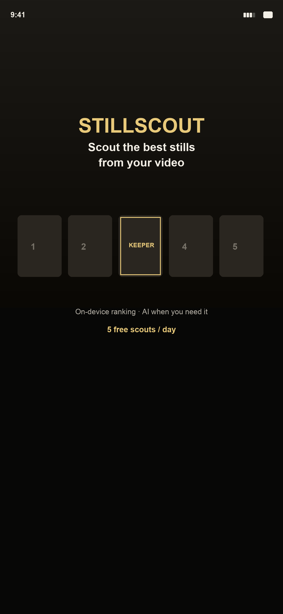
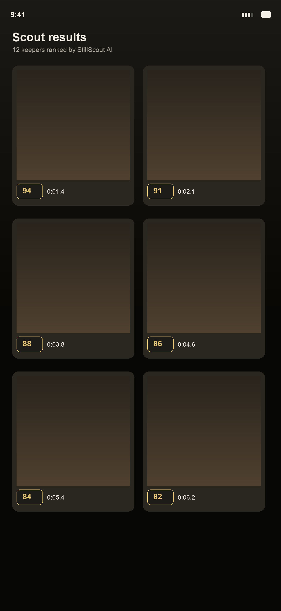
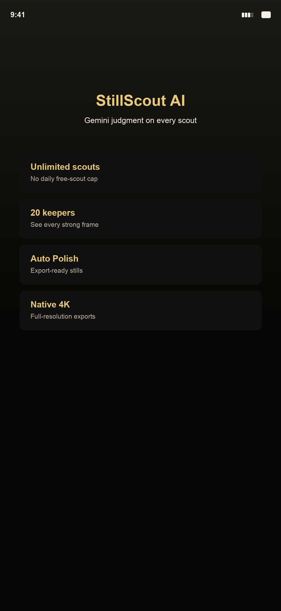
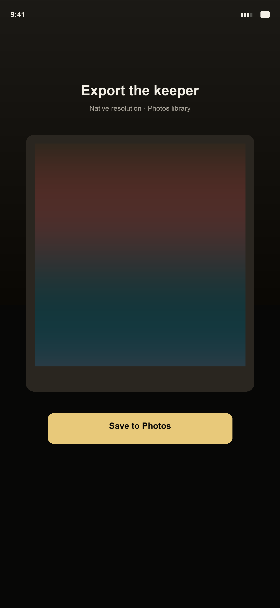

# StillScout

[](https://github.com/somyahangsandesh/StillScout/actions/workflows/ci.yml)
[](https://github.com/somyahangsandesh/StillScout)
[](https://flutter.dev)

**Scout the perfect still.**  
An iOS app for creators who shoot video but post photos — find the frame you’d actually share, without scrubbing forever.

🌐 **Site & legal:** [somyahangsandesh.github.io/StillScout](https://somyahangsandesh.github.io/StillScout/)  
📬 **Support:** [stillscout.support@gmail.com](mailto:stillscout.support@gmail.com) · [GitHub Issues](https://github.com/somyahangsandesh/StillScout/issues)

---

## Why this exists

You already captured the moment on video. The still you want is in there — buried between blinks, half-smiles, and motion blur. StillScout imports a short clip, pulls candidate frames, ranks the keepers with on-device Apple Vision (and optional **StillScout AI Pro** in the cloud), then lets you polish and export post-ready stills.

No watermarks. No “AI sludge” UI. Just a calm tool that respects your camera roll.

Built for **Shipathon 2026**. iPhone and iPad only — this repo is the canonical StillScout codebase.

## What you get

| | Free | AI Pro |
|---|------|--------|
| Scouts | 5 / day (UTC) | Unlimited on-device scouts |
| Keeper picks shown | Top 5 (8 on your first successful scout) | Top 20 |
| Cloud ranking | One complimentary AI scout when online | StillScout AI via secure edge proxy |
| Polish & 4K export | Limited | Full Auto Polish + native re-extract |

Details, quotas, and server limits: **[Developer guide →](docs/DEVELOPER.md)**

## Screenshots

<p align="center">
  
  
  
  
</p>

## Quick start (developers)

**Requirements:** Flutter 3.24+, Xcode, an Apple Developer team for device builds.

```bash
git clone https://github.com/somyahangsandesh/StillScout.git
cd StillScout
flutter pub get
cp lib/config/secrets.local.example.dart lib/config/secrets.local.dart
# Add Supabase + RevenueCat keys in secrets.local.dart — see the example file.
flutter run
```

Full setup, architecture, Supabase deploy, TestFlight, and App Store checklists: **[docs/DEVELOPER.md](docs/DEVELOPER.md)**

## Documentation

| Topic | Link |
|--------|------|
| Developer / ops | [docs/DEVELOPER.md](docs/DEVELOPER.md) |
| TestFlight | [docs/TESTFLIGHT.md](docs/TESTFLIGHT.md) |
| App Store launch | [docs/APP_STORE_LAUNCH.md](docs/APP_STORE_LAUNCH.md) |
| Privacy · Terms · Support | [docs/legal/](docs/legal/) |
| Marketing (Stories / Reels) | [docs/marketing/](docs/marketing/) |

## Contributing & security

Found a bug or have a thoughtful idea? **[Open an issue](https://github.com/somyahangsandesh/StillScout/issues)** — please don’t attach private videos; describe steps and iOS version instead.

- [Contributing](CONTRIBUTING.md) — how we work in this repo  
- [Security](SECURITY.md) — report vulnerabilities privately  

## License

Source is published for transparency and collaboration around StillScout. **All rights reserved** — see [LICENSE](LICENSE). StillScout name, branding, and App Store distribution are not open-source grants.

---

<p align="center"><sub>StillScout · Scout. Polish. Post.</sub></p>
